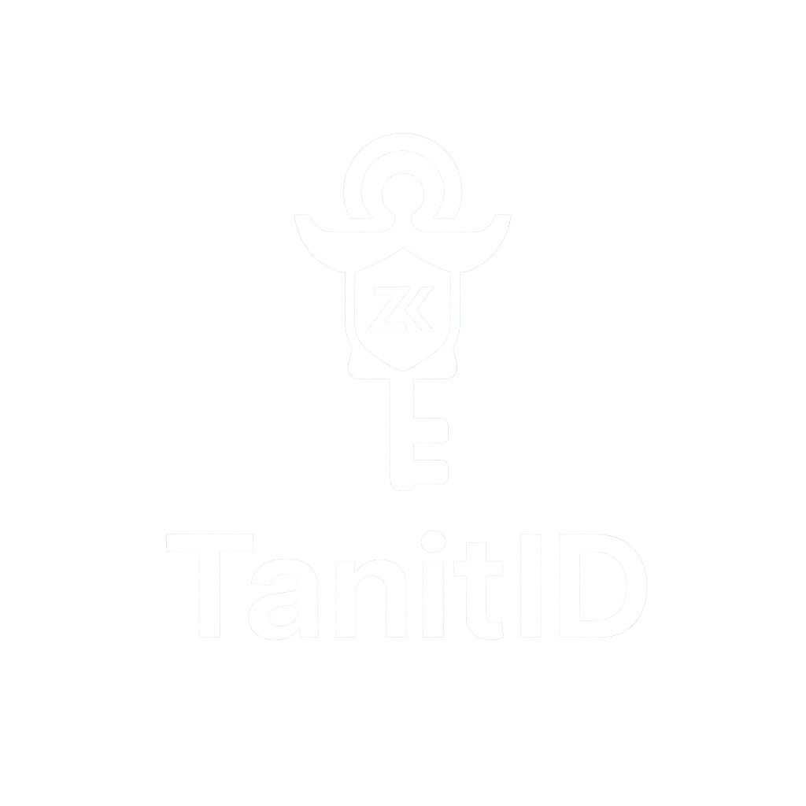

# TanitID - Privacy-Preserving Identity Attestations

<p align="center">
  
</p>

**Protect facts, not data.** TanitID shows how to use **Midnight’s Compact smart contracts** and a **MidnightJS** web app to verify facts about a user — like **Age ≥ 18**, **Valid CIN**, or **Student Status** — **without revealing raw personal data (PII)**.

### ✨ Why “TanitID”
We chose the name **TanitID** after [Tanit](https://en.wikipedia.org/wiki/Tanit), the Carthaginian goddess of protection and fertility, whose symbol remains one of Tunisia’s most enduring cultural icons. Just as Tanit safeguarded her people, **TanitID protects users’ digital identities**: revealing only what is necessary and keeping everything else hidden. This blend of **heritage and innovation** positions TanitID as a uniquely Tunisian approach to privacy-preserving digital identity — rooted in trust, designed for the future.

---

## Why Tunisia (problem background)
Tunisia’s rapid digitization has outpaced its privacy safeguards. Civil society has warned that the government’s **Mobile ID (e‑Houwiya)** program launched with limited transparency and weak oversight, risking users’ data protection and trust ([Access Now — Mobile ID “black box”](https://www.accessnow.org/tunisia-must-open-mobile-id-black-box/)).

Beyond Mobile ID, a trio of initiatives — **biometric ID**, **Mobile ID**, and a **subsidies compensation platform** — has been criticized for opacity and the potential to enable mass surveillance, identity theft, and data exploitation if deployed without robust safeguards ([Access Now — digitization risks](https://www.accessnow.org/tunisias-digitization-programs-threaten-the-privacy-of-millions/); [press: postpone subsidies platform](https://www.accessnow.org/press-release/tunisia-postpone-digital-platform-for-subsidies-compensation-launch/)).

These risks are not theoretical: in **July 2025**, Tunisia’s **national university network** reportedly suffered a data leak affecting up to ~150,000 students ([SearchInform 2025 roundup](https://searchinform.com/blog/2025/7/16/data-breaches-in-saudi-arabia-and-tunisia/)).

At the same time, private‑sector **KYC/AML** practices push for extensive data collection and long retention horizons, amplifying exposure ([VOVE ID — KYC in Tunisia, 2025](https://blog.voveid.com/kyc-compliance-in-tunisia-a-2025-guide-for-digital-businesses/)).

**Our approach:** ZK TanitID attestations — **prove the fact**, don’t expose the data.

---

## Demo Features
- ✅ **Age ≥ 18** verifier (no DOB disclosure)
- ✅ **Valid CIN** verifier (no CIN number disclosure; supports revocation root)
- ✅ **Current Student** verifier (term-bounded, identity‑preserving)
- 🔒 **No raw PII on‑chain** — only commitments + ZK proofs
- 🧾 **Open-source** (Apache‑2.0) and auditable (avoids “black box” concerns)

---

## Architecture
- **Contracts (Compact):** verifier contracts for age, CIN validity, and student status.
- **Frontend (MidnightJS):** request → generate proof locally → submit to contract.
- **Data:** credentials are stored client‑side; blockchain sees only **commitments & proofs**.

```
/contracts
  verifier_age.compact
  verifier_cin.compact
  verifier_student.compact
/frontend
  src/
    App.tsx
    main.tsx
    components/ProofForm.tsx
    services/midnight.ts
  index.html
/docs
  THREAT_MODEL.md
LICENSE
```

---
