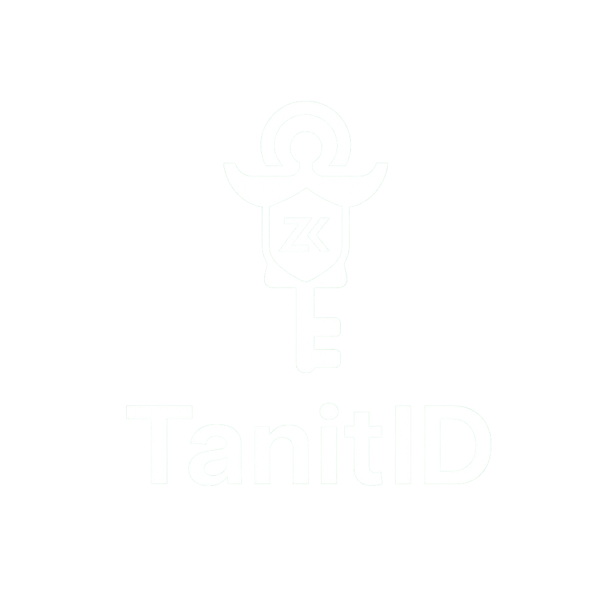
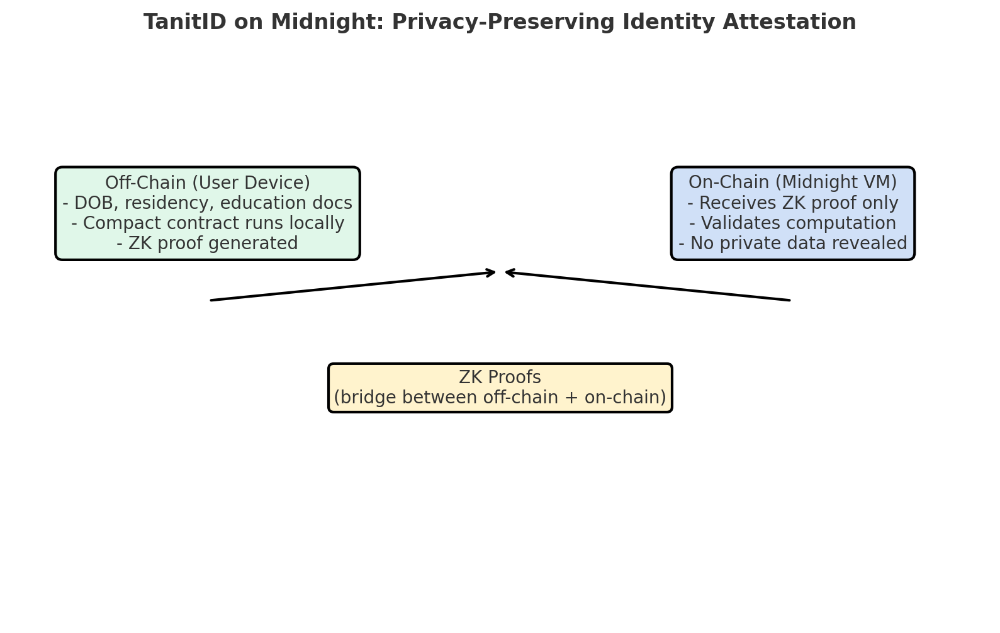

# ZKTanitID - Privacy-Preserving Identity Attestations - This project is built on the Midnight Network

<p align="center">
  
</p>

**Protect facts, not data.** ZKTanitID shows how to use **Midnight’s Compact smart contracts** and a **MidnightJS** web app to verify that a user holds a **Valid CIN (Carte d’Identité Nationale)** — **without revealing raw personal data (PII)**.

### ✨ Why “ZKTanitID”
We chose the name **ZKTanitID** after [Tanit](https://en.wikipedia.org/wiki/Tanit), the Carthaginian goddess of protection and fertility, whose symbol remains one of Tunisia’s most enduring cultural icons. Just as Tanit safeguarded her people, **ZKTanitID protects users’ digital identities**: revealing only what is necessary and keeping everything else hidden. This blend of **heritage and innovation** positions ZKTanitID as a uniquely Tunisian approach to privacy-preserving digital identity — rooted in trust, designed for the future.

---

## Why Tunisia (problem background)
Tunisia’s rapid digitization has outpaced its privacy safeguards. Civil society has warned that the government’s **Mobile ID (e‑Houwiya)** program launched with limited transparency and weak oversight, risking users’ data protection and trust ([Access Now — Mobile ID “black box”](https://www.accessnow.org/tunisia-must-open-mobile-id-black-box/)).

Beyond Mobile ID, a trio of initiatives — **biometric ID**, **Mobile ID**, and a **subsidies compensation platform** — has been criticized for opacity and the potential to enable mass surveillance, identity theft, and data exploitation if deployed without robust safeguards ([Access Now — digitization risks](https://www.accessnow.org/tunisias-digitization-programs-threaten-the-privacy-of-millions/); [press: postpone subsidies platform](https://www.accessnow.org/press-release/tunisia-postpone-digital-platform-for-subsidies-compensation-launch/)).

These risks are not theoretical: in **July 2025**, Tunisia’s **national university network** reportedly suffered a data leak affecting up to ~150,000 students ([SearchInform 2025 roundup](https://searchinform.com/blog/2025/7/16/data-breaches-in-saudi-arabia-and-tunisia/)).

At the same time, private‑sector **KYC/AML** practices push for extensive data collection and long retention horizons, amplifying exposure ([VOVE ID — KYC in Tunisia, 2025](https://blog.voveid.com/kyc-compliance-in-tunisia-a-2025-guide-for-digital-businesses/)).

**Our approach:** ZK TanitID attestations — **prove the fact**, don’t expose the data.

---

## Demo Features
- ✅ **Valid CIN** verifier (no CIN number disclosure; supports revocation root)
- 🔒 **No raw PII on‑chain** — only commitments + ZK proofs
- 🧾 **Open-source** (Apache‑2.0) and auditable (avoids “black box” concerns)

---

## Architecture
- **Contracts (Compact):** verifier contract for CIN (Carte d'Identité Nationale) validity.
- **Frontend (MidnightJS):** request → generate proof locally → submit to contract.
- **Data:** credentials are stored client‑side; blockchain sees only **commitments & proofs**.

```
/contracts
  cin_verifier.compact
/frontend
  public/
  src/
    App.tsx
    main.tsx
    components/
    services/
  index.html
/docs
  THREAT_MODEL.md
  TUTORIAL.md
LICENSE
README.md
```
---

## Quickstart

### 1) Frontend
```bash
cd frontend
npm install
npm run dev
```

---

### How It Works

ZKTanitID leverages Midnight’s split-computation model:

- **Off-Chain (User Device):**  
  Sensitive data (e.g., DOB, NIC, education) is processed locally.  
  Compact contracts run on the device, generating a ZK proof.  

- **ZK Proofs Bridge:**  
  Only the proof is sent to the chain, ensuring no personal data is leaked.  

- **On-Chain (Midnight VM):**  
  The blockchain validates the proof without accessing the underlying private data.  

This ensures compliance with data protection while enabling verifiable identity checks.



1. **User Inputs Data (Off-Chain)**  
   The citizen enters sensitive details such as Date of Birth, NIC, or education records into the ZKTanitID app.  
   This information **never leaves their device**.

2. **Compact Contract Execution**  
   A privacy-preserving smart contract, written in Compact, runs locally.  
   It checks whether the user holds a valid CIN.

3. **Zero-Knowledge Proof Generation**  
   Instead of sending raw data, the app generates a **ZK proof** that the condition holds true.  
   Example: *”I hold a valid CIN”* without revealing the actual CIN number.

4. **Proof Submission to Midnight**  
   The proof is sent to the Midnight blockchain.  
   The chain cannot see the user’s private data—only the proof.

5. **On-Chain Verification**  
   Midnight’s VM verifies the proof and updates the smart contract state.  
   This enables trusted identity attestation without exposing sensitive information.

✅ With this flow, ZKTanitID ensures **compliance, privacy, and verifiability** in digital identity use cases.
